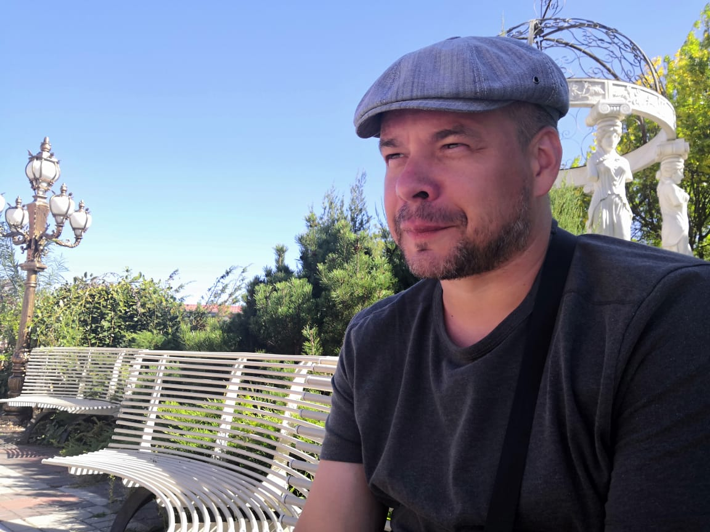

Рахманов Александр Витальевич

Мне 44 года. Работаю заместителем начальника цеха в компании ООО "Альфа-Силтэк". Но на данный момент решил сменить сферу деятельности и прохожу обучение по курсу "Java-разработчик" от Нетологии. Учёба проходит хорошо, но не без трудностей.

На сегодняшний день приобретены знания и навыки по следующим темам блока "Основы Java":
1. Знакомство с языком программирования Java.
2. Структура программы.
3. Условные операторы и циклы.
4. Типы данных Java: примитивы.
5. Типы данных Java: объекты.
6. Структура класса.
7. Массивы одномерные.
8. Массивы многомерные.
9. Модификаторы доступа, наследование.
10. Полиморфизм.
11. Абстракции и интерфейсы.
12. Исключения, Stacktrace.
13. Generics в коллекциях и методах.
14. Коллекции List.
15. Коллекции Queue.
16. Коллекции HashSet и HashMap.
17. Коллекции TreeMap и TreeSet.

Так же пройден курс по основам работы в Git.

